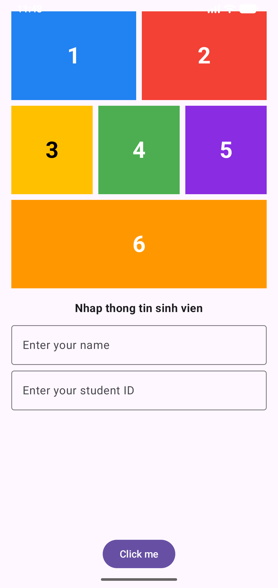
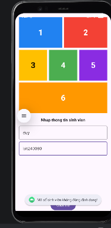
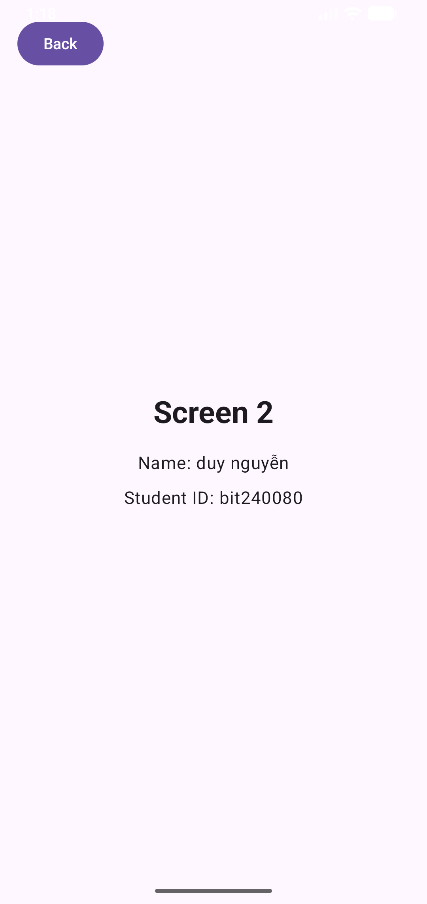

# 📱 Android Jetpack Compose - Multi-Screen Navigation & State Validation

[](https://developer.android.com/)
[](https://kotlinlang.org/)
[](https://developer.android.com/jetpack/compose)
[](https://m3.material.io/)
[](https://developer.android.com/jetpack/compose/navigation)

> Dự án bài tập Android hiện đại phát triển bằng **Jetpack Compose**, xây dựng kiến trúc điều hướng đa màn hình (**Navigation Compose**), quản lý trạng thái form (**UI State Management**) và xử lý kiểm tra tính hợp lệ của dữ liệu đầu vào (**Form Validation**).

---

## 📌 Mục lục
- [Giới thiệu dự án](#-giới-thiệu-dự-án)
- [Công cụ & Công nghệ sử dụng](#-công-cụ--công-nghệ-sử-dụng)
- [Quá trình thực hiện & Kiến trúc](#-quá-trình-thực-hiện--kiến-trúc)
- [Hình ảnh Demo giao diện](#-hình-ảnh-demo-giao-diện)
- [Video Demo chạy ứng dụng](#-video-demo-chạy-ứng-dụng)
- [Hướng dẫn cài đặt & Chạy ứng dụng](#-hướng-dẫn-cài-đặt--chạy-ứng-dụng)
- [Cấu trúc thư mục dự án](#-cấu-trúc-thư-mục-dự-án)
- [Thông tin tác giả](#-thông-tin-tác-giả)

---

## 📖 Giới thiệu dự án

Ứng dụng gồm hai màn hình chính với luồng tương tác hoàn chỉnh:
1. **Screen 1 (Màn hình chính):**
   * **Nửa trên:** Layout 6 khối màu được phân bổ trực quan theo tỷ lệ hàng bằng `Modifier.weight`.
   * **Nửa dưới:** Form tiếp nhận thông tin sinh viên (*Họ và tên*, *Mã số sinh viên*) với các trường `OutlinedTextField` và nút `Click me`.
   * **Logic Validation:** Kiểm tra dữ liệu không được để trống, so khớp định danh sinh viên (không phân biệt chữ hoa/thường) và thông báo phản hồi qua `Toast`.
2. **Screen 2 (Màn hình chi tiết):**
   * Nút `Back` đặt tại góc trên bên trái cho phép quay trở lại màn hình trước thông qua BackStack.
   * Khối trung tâm hiển thị trực quan thông tin sinh viên được truyền an toàn qua Route parameters.

---

## 🛠 Công cụ & Công nghệ sử dụng

| Phân loại | Công nghệ / Công cụ | Mô tả chi tiết |
| :--- | :--- | :--- |
| **Ngôn ngữ lập trình** | **Kotlin 2.x** | Ngôn ngữ hiện đại, an toàn kiểu dữ liệu (null-safety) và tối ưu cho Android. |
| **Giao diện người dùng (UI)** | **Jetpack Compose (BOM)** | Bộ công cụ UI khai báo (Declarative UI) chính thức của Google. |
| **Hệ thống thiết kế** | **Material Design 3 (M3)** | Bộ thành phần giao diện chuẩn (`MaterialTheme`, `OutlinedTextField`, `Button`, `Surface`). |
| **Điều hướng (Navigation)** | **Navigation Compose 2.7.7** | Quản lý điều hướng đa màn hình, truyền tham số động qua đường dẫn (`route`). |
| **Môi trường phát triển (IDE)**| **Android Studio** | Môi trường lập trình chính thức của Google dành cho Android. |
| **Hệ thống Build** | **Gradle (Kotlin DSL - `.kts`)** | Quản lý dependencies, plugin và cấu hình build ứng dụng. |
| **Mục tiêu SDK** | **Min SDK: 24 \| Compile SDK: 35+** | Hỗ trợ từ Android 7.0 (Nougat) trở lên đến các phiên bản Android mới nhất. |

---

## 🚀 Quá trình thực hiện & Kiến trúc

### 1. Phân chia Layout chuẩn tỷ lệ với Jetpack Compose
Màn hình được phân chia cân đối làm hai phần bằng `Column` và `Modifier.weight(1f)`:
* **Hàng 1:** Gồm 2 khối màu (Xanh dương, Đỏ) theo tỷ lệ `1 : 1`.
* **Hàng 2:** Gồm 3 khối màu (Vàng, Xanh lá, Tím) theo tỷ lệ `1 : 1 : 1`.
* **Hàng 3:** Gồm 1 khối màu Cam chiếm trọn chiều rộng (`fillMaxWidth`).

### 2. Quản lý trạng thái (State Management) & Kiểm tra dữ liệu (Validation)
* Sử dụng `remember { mutableStateOf("") }` để theo dõi giá trị nhập của `name` và `studentId`.
* **Quy tắc kiểm tra (Validation):**
  * **Trống dữ liệu:** Hiển thị thông báo Toast `Dữ liệu không được để trống`.
  * **Sai định dạng MSSV:** Mã số sinh viên bắt buộc phải viết hoa, chữ cái đầu tiên là `B` và có 6 chữ số (ví dụ: `BIT240080`). Nếu sai định dạng, hiển thị thông báo Toast `Mã số sinh viên không đúng định dạng!`.
  * **Đúng thông tin sinh viên:** So khớp Name (`"duy nguyễn"`, không phân biệt hoa thường) và MSSV (`"BIT240080"`, chuẩn chữ hoa).
  * **Sai thông tin sinh viên:** Hiển thị thông báo Toast `Thông tin sinh viên không chính xác!`.

### 3. Điều hướng an toàn với Navigation Compose
* Khởi tạo `NavHost` với `rememberNavController()` và `startDestination = "screen1"`.
* Định nghĩa route nhận tham số: `screen2/{name}/{studentId}` với kiểu dữ liệu `NavType.StringType`.
* **Xử lý URL Encoding:** Tên người dùng tiếng Việt có dấu và dấu cách (`duy nguyễn`) được mã hóa qua `Uri.encode()` trước khi truyền qua route để ngăn ngừa triệt để lỗi crash runtime (`IllegalArgumentException`).

---

## 📸 Hình ảnh Demo giao diện

| 1. Giao diện ban đầu (Screen 1) | 2. Báo lỗi sai định dạng MSSV | 3. Nhập đúng & Chuyển màn hình (Screen 2) |
| :---: | :---: | :---: |
|  |  |  |
| *Giao diện 6 khối màu tỷ lệ & Form nhập liệu* | *Ảnh minh họa cho việc khi nhập mã số sinh viên không đúng định dạng (Toast: "Mã số sinh viên không đúng định dạng!")* | *Màn hình chi tiết nhận dữ liệu & Nút Back* |

---

## 🎥 Video Demo chạy ứng dụng

> [!NOTE]
> **Video demo:** https://drive.google.com/file/d/14G9tRl0KQBrE55fmN-lAGo72wIDwmHB4/view?usp=sharing

---

## 💻 Hướng dẫn cài đặt & Chạy ứng dụng

### Yêu cầu môi trường
* Đã cài đặt **Android Studio** (bản Iguana / Jellyfish / Koala / Ladybug hoặc mới hơn).
* JDK 17 hoặc JDK 21+ (hoặc Android Studio Embedded JBR).
* Android Emulator hoặc thiết bị thật bật chế độ **USB Debugging**.

### Các bước thực hiện:
1. **Clone repository về máy tính:**
   ```bash
   git clone https://github.com/duynguyen1012/bai_tap_buoi_3.git
   ```

2. **Mở dự án trong Android Studio:**
   * Khởi động Android Studio ➔ Chọn **Open** ➔ Điều hướng tới thư mục vừa clone.

3. **Đồng bộ Gradle (Sync Project):**
   * Chờ Android Studio tự động tải dependencies và hoàn tất Gradle Sync.

4. **Chạy ứng dụng:**
   * Chọn máy ảo hoặc thiết bị Android đã kết nối ở thanh công cụ phía trên.
   * Nhấn nút **Run ▶** (hoặc tổ hợp phím `Shift + F10`).

---

## 📂 Cấu trúc thư mục dự án

```text
bai_tap_buoi_3/
├── app/
│   ├── src/
│   │   ├── main/
│   │   │   ├── java/com/example/baitapbuoi1/
│   │   │   │   ├── MainActivity.kt        # Toàn bộ mã nguồn Screen 1, Screen 2, Navigation & Logic
│   │   │   │   └── ui/theme/              # Cấu hình màu sắc, kiểu chữ và Material Theme
│   │   │   ├── res/                       # Resource drawables, mipmaps, strings, XML
│   │   │   └── AndroidManifest.xml        # Tệp cấu hình Activity và Application
│   │   └── test/                          # Unit tests
│   └── build.gradle.kts                   # Dependencies và cấu hình module App
├── docs/
│   └── screenshots/                       # Hình ảnh demo ứng dụng đưa vào README
├── gradle/
│   └── libs.versions.toml                 # Version Catalog quản lý tập trung phiên bản thư viện
├── build.gradle.kts                       # Root build configuration
├── settings.gradle.kts                    # Root settings và khai báo module
└── README.md                              # Tài liệu giới thiệu dự án
```

---

## 👤 Người thực hiện:

* **Họ và tên:** Nguyễn Đức Duy
* **Mã số sinh viên (MSSV):** BIT240080
* **GitHub Profile:** [@duynguyen1012](https://github.com/duynguyen1012)
* **Dự án:** Bài tập thực hành Android Native với Jetpack Compose
